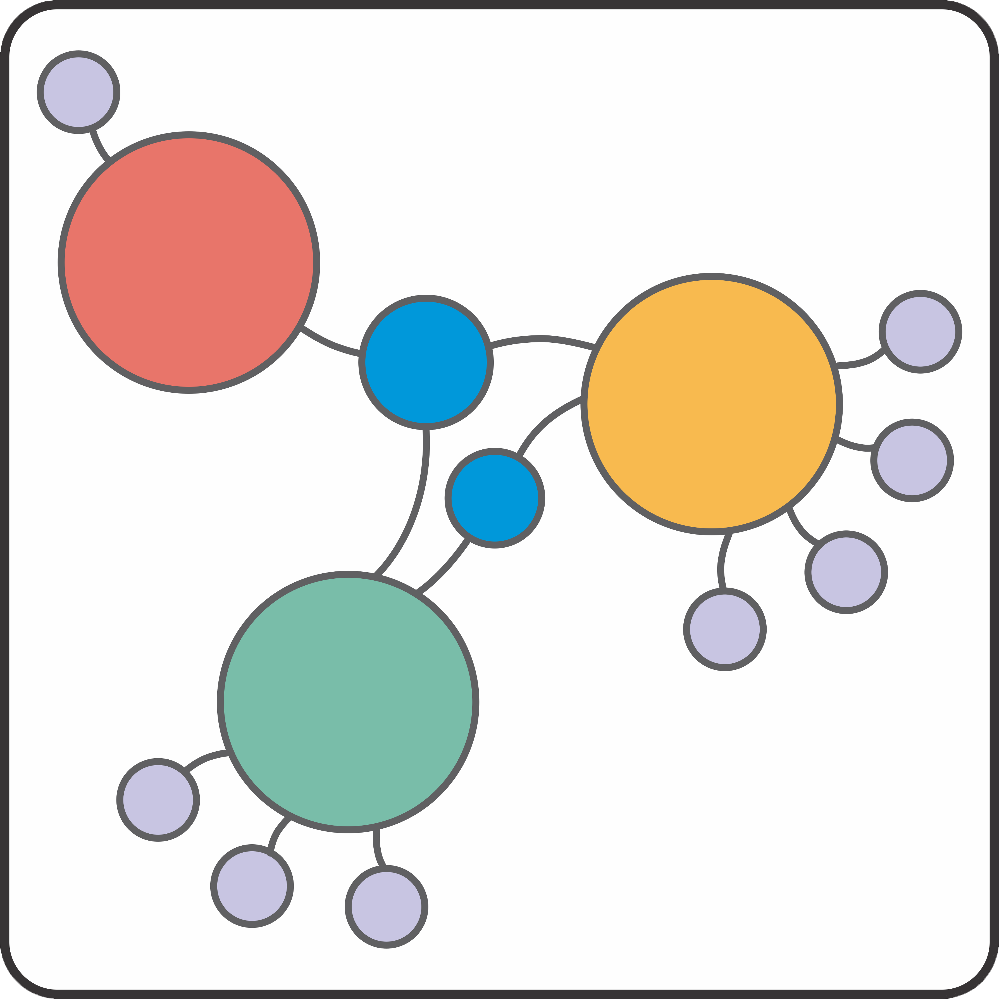

<!-- README.md is generated from README.Rmd. Please edit that file -->

  

# **ConnectR** 

 

Este es un paquete completamente desarrollado en R, el cual calcula los índices propuestos por [Sidor et al. (2013)](https://doi.org/10.1073/pnas.1302323110).

Estos índices incluyen: 
**Biogeographic Connectedness**, **Network Cluserting**, **Average Ocurrences**, y **Average Endemics**.

El usuario final solo necesitará crear el archivo de entrada en el formato correcto,
indicar qué ídice, si no todos ellos, será calcualado y especificar el número de edades (número de páginas) para evaluar.

El programa arroajára el índice deseado para cada temporalidad indicada, al tiempo que también realizará el correspondiente remuestreo paramétrico y lo graficará.
Estos cálculos son complementarios a visualizaciones de redes complejas que pueden ser creados en [Gephi](https://gephi.org/) o con [igraph R package](https://igraph.org/).

Este tipo de análisis son relevantes porque nos permiten realizar estudios biogeográficos de fauna fósil usando exclusivamente sus ocurrencias geográficas. Además de la documentación, [ConnectR](https://github.com/ChuchoDC/ConnectR) incluye un conjunto de datos empíricos de peces fósiles del Cretácico, Aulopiformes, un grupo ampliamente distribuido con un registro fósil numeroso y bien conocido. 

Para que el paquete funcion correctamente, las dependencias necesarias son 
`readxl` 
`dplyr`  
`ggplot2` 
`gridExtra` 
`scales` 
`pbapply` 

## Contentenido

- [Guía de instalación y requisistos](Installation_Dependencies.md)
- [Documentación](Documentation.md)
- [Example de uso (En construcción)]() 

**Importante** 
El paquete se encuentra en su etapa final de desarrollo.
Los autores están evaluándolo con datos empíricos y simulados para asegurar su funcionamiento correcto. 

The software is in its final stage of development. 
Authors are testing it with empirical and simulated datasets to ensure its correct operation.   
 
## **Autores**:
[Angel Angeles Cortés](https://github.com/4ngel19)  
email:
<a href="mailto:angel_10@ciencias.unam.mx" class="email">angel_10@ciencias.unam.mx</a>

[Dr. Jesús Alberto Díaz-Cruz](https://github.com/ChuchoDC)  
email:
<a href="mailto:vertebrata.j@ciencias.unam.mx" class="email">vertebrata.j@ciencias.unam.mx</a>

